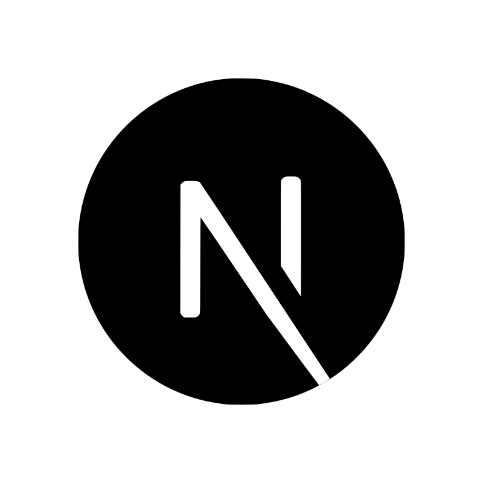

## About me:

* 🧑‍💻 Software Engineer 
* 📩 How to contact me: [TG:@jopaflex](https://t.me/jopaflex), [IG:@neforward](https://www.instagram.com/neforward/), Phone: +996508777235, E-mail: mairambekrexport@gmail.com 

 

 

## Tech Stack ⚡️

	&nbsp;
	<b>React</b>

&nbsp;&nbsp;&nbsp;&nbsp;&nbsp;

	&nbsp;
	<b>Redux Toolkit</b>

&nbsp;&nbsp;&nbsp;&nbsp;&nbsp;

	&nbsp;
	<b>Next.js</b>

 
 

	&nbsp;
	<b>Vue</b>

&nbsp;&nbsp;&nbsp;&nbsp;&nbsp;

	&nbsp;
	<b>VueX</b>

&nbsp;&nbsp;&nbsp;&nbsp;&nbsp;

	&nbsp;
	<b>Nuxt.js</b>

 
 

	&nbsp;
	<b>Node.js</b>

&nbsp;&nbsp;&nbsp;&nbsp;&nbsp;

	&nbsp;
	<b>TypeScript</b>

&nbsp;&nbsp;&nbsp;&nbsp;&nbsp;

	&nbsp;
	<b>JavaScript</b>

 
 

	&nbsp;
	<b>SASS</b>

&nbsp;&nbsp;&nbsp;&nbsp;&nbsp;

	&nbsp;
	<b>TailwindCSS</b>

&nbsp;&nbsp;&nbsp;&nbsp;&nbsp;

	&nbsp;
	<b>Ant Design</b>

 
 

	&nbsp;
	<b>Git</b>

&nbsp;&nbsp;&nbsp;&nbsp;&nbsp;

	&nbsp;
	<b>GSAP</b>

 
 
 

## Contact 📞

	&nbsp;
	<a href="https://t.me/jopaflex" target="_blank"><b>Telegram</b></a>

&nbsp;&nbsp;&nbsp;&nbsp;&nbsp;

	&nbsp;
	<a href="https://www.instagram.com/neforward/" target="_blank"><b>IG</b></a>

&nbsp;&nbsp;&nbsp;&nbsp;&nbsp;

	&nbsp;
	<a href="https://twitter.com/neforward" target="_blank"><b>Twitter</b></a>

